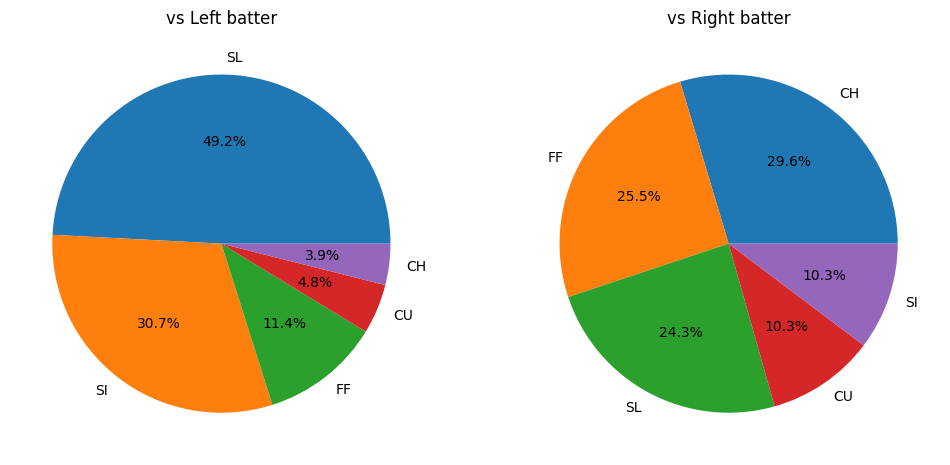
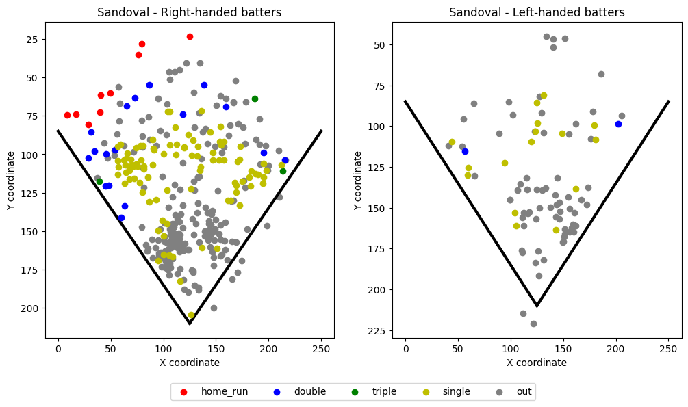
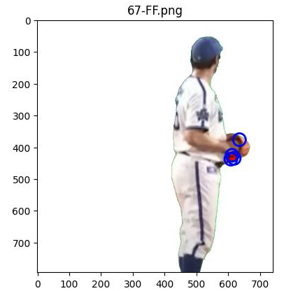
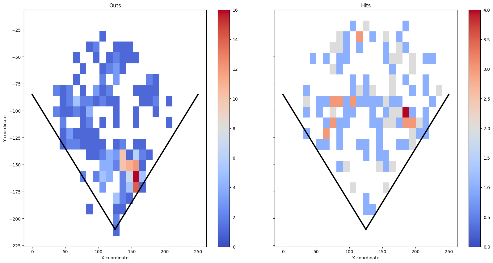
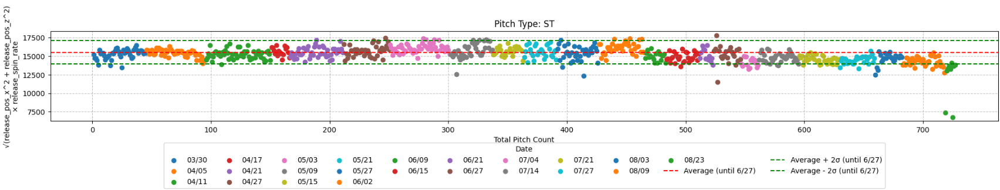

# MLB Data Analysis

Professional-grade MLB data analysis with focus on practical scouting, performance tracking, injury prevention, and image analysis.
(実用的なスカウティング、パフォーマンス追跡、怪我予防、画像分析に焦点を当てたプロフェッショナルレベルのMLBデータ解析)

## 🎯 Project Overview

This project demonstrates practical data analysis skills through real-world baseball analytics. All analyses use Python and MLB Statcast data to extract actionable insights for player evaluation, strategic planning, and performance monitoring. Includes both statistical analysis and computer vision techniques.

(実際の野球分析を通じて実践的なデータ解析スキルを実証するプロジェクトです。Pythonと MLB Statcastデータを使用して、選手評価、戦略立案、パフォーマンスモニタリングのための実用的な洞察を抽出します。統計分析とコンピュータビジョン技術の両方を含みます。)

**📌 Both Python (pandas) and SQL (DuckDB) versions available for key analyses.**
**(主要な分析にはPython版とSQL版の両方を用意しています)**

## 🛠️ Tech Stack

- **Python 3.x**
- **pybaseball**: MLB Statcast data acquisition
- **pandas**: Data processing and analysis
- **matplotlib / seaborn**: Statistical visualization
- **bar_chart_race**: Animated visualizations
- **numpy**: Numerical computing
- **PIL (Pillow)**: Image processing
- **scikit-learn**: Machine learning (KMeans clustering)
- **DuckDB**: In-process SQL database for analytical queries
- **Jupyter Notebook**: Interactive analysis environment

## 📊 Analysis Portfolio

### 1. [WBC 2023: Pre-Game Scouting Report - Patrick Sandoval](./notebooks/wbc_2023_sandoval_scouting.ipynb)


*Key Finding: Against left-handed batters, Sandoval throws sliders 49.2% of the time - nearly half of all pitches.*
*(重要な発見: 左打者に対して、サンドバルはスライダーを49.2%の割合で投げる - ほぼ半分の投球)*


*Key Finding: No left-handed batter hit a home run off Sandoval in the previous season.*
*(重要な発見: 前シーズン、左打者は誰もサンドバルからホームランを打っていない)*

**Real-world application**: Pre-game scouting analysis of Mexico pitcher Patrick Sandoval conducted before the 2023 World Baseball Classic Japan vs. Mexico semifinal game.

(実際の応用例: 2023年ワールド・ベースボール・クラシック準決勝、日本対メキシコ戦前に実施したメキシコ投手パトリック・サンドバルの試合前スカウティング分析)

**Analysis Components:**

**Pitch Repertoire Analysis** (投球レパートリー分析)
- 5 pitch types identified: Changeup (CH), Sinker (SI), 4-Seam Fastball (FF), Slider (SL), Curveball (CU)
- Pitch usage frequency by batter handedness (打者の左右別投球頻度)
- Strike zone location mapping for each pitch type (各球種のストライクゾーン配球マップ)

**Performance Benchmarking** (パフォーマンスベンチマーク)
- Velocity comparison: Sandoval vs. MLB average by pitch type
- Spin rate analysis: Individual vs. league standards
- Statistical significance testing (mean ± standard deviation)

**Strategic Insights** (戦略的洞察)
- Left-handed vs. right-handed batter tendencies
- Hit distribution patterns (singles, doubles, triples, home runs)
- Batting average and home run vulnerability by batter side
- Visual heat maps of pitch locations and outcomes

**Tools:** pybaseball, pandas, matplotlib, seaborn, numpy

[](https://colab.research.google.com/github/yasumorishima/mlb-data-analysis/blob/main/notebooks/wbc_2023_sandoval_scouting.ipynb)

**Data Period:** 2022 MLB Season (March 30 - December 31, 2022)  
**Analysis Date:** March 2023 (pre-WBC)  
**Practical Value:** Data-driven game preparation and strategic planning
(実用的価値: データに基づく試合準備と戦略立案)

**Key Findings Example:**
- Identified pitch location tendencies vs. left/right batters
- Quantified velocity differentials from league average
- Mapped vulnerable zones for offensive strategy

---

### 2. [Trevor Bauer Set Position Image Analysis (2023)](./notebooks/bauer_set_position_analysis_2023.ipynb)


*Key Finding: K-means clustering detected potential "tells" in glove position across different pitch types.*
*(重要な発見: K-meansクラスタリングにより、球種ごとのグラブ位置に癖がある可能性を検出)*

**Real-world application**: Image-based analysis of pitcher's set position to detect potential "tells" or mechanical inconsistencies that batters might exploit.

(実際の応用例: 打者が利用できる可能性のある「癖」や機械的な不整合を検出するための、投手のセットポジションの画像ベース分析)

**Background:**
In 2023, when Trevor Bauer (Yokohama DeNA BayStars) was hit hard in a game against Hiroshima, this analysis was conducted to investigate whether there were detectable differences in his set position across different pitch types.

(背景: 2023年、トレバー・バウアー(横浜DeNAベイスターズ)が広島戦で打ち込まれた際、球種ごとのセットポジションに検出可能な違いがあるかどうかを調査するために実施した分析)

**Analysis Methodology:**

**Image Processing Pipeline** (画像処理パイプライン)
1. Background removal (green field transparency using RGB thresholds)
   - (背景除去 - RGBしきい値を使用した緑フィールドの透過処理)
2. Frame-by-frame difference detection (フレーム間差分検出)
3. Pixel-level comparison across pitch types (球種間のピクセルレベル比較)
4. Statistical clustering of difference regions (差分領域の統計的クラスタリング)

**Computer Vision Techniques** (コンピュータビジョン技術)
- RGB channel processing and alpha compositing
- Image differencing with threshold-based filtering (threshold = 250)
- K-means clustering (n_clusters=4) to identify regions of maximum variance
- Visualization of difference hotspots with circular markers

**Analysis Workflow**
- Compare each pitch type's frames against the first frame of that pitch type
- Extract pixels with significant differences (>250 RGB delta)
- Cluster difference points to identify key body position variations
- Visualize results with red highlighting and blue cluster centers

**Tools:** Python, PIL (Pillow), NumPy, scikit-learn (KMeans), matplotlib

[](https://colab.research.google.com/github/yasumorishima/mlb-data-analysis/blob/main/notebooks/bauer_set_position_analysis_2023.ipynb)

**Technical Stack:**
- Image processing: PIL (Pillow), NumPy arrays
- Machine learning: K-means clustering for spatial analysis
- Data visualization: matplotlib with patches overlay

---

### 3. [Shohei Ohtani Batting Analysis (2022)](./notebooks/ohtani_batting_analysis_2022.ipynb)


*Key Finding: High concentration of hits through second base area - this likely explains why teams deployed the "Ohtani Shift" with defensive positioning in that zone.*
*(重要な発見: セカンド付近を通るヒットが集中している - これがチームが「大谷シフト」でそのゾーンに守備を配置した理由と推測される)*

Comprehensive analysis of Shohei Ohtani's batting performance during his 2022 MVP season.
(大谷翔平の2022年MVP シーズンにおける打撃パフォーマンスの包括的分析)

**Key Features:**
- Batted ball direction analysis by pitch location (投球位置別の打球方向分析)
- Hit distribution across strike zone (ストライクゾーン全体のヒット分布)
- Performance visualization with heat maps
- Contact quality metrics

**Tools:** pybaseball, pandas, matplotlib, seaborn

[](https://colab.research.google.com/github/yasumorishima/mlb-data-analysis/blob/main/notebooks/ohtani_batting_analysis_2022.ipynb)

---

### 4. [MLB Home Run Race 2024](./notebooks/mlb_home_run_race_2024.ipynb)

https://github.com/user-attachments/assets/c2f5565c-ba87-419a-aaa3-fdc993034a95

*Dynamic bar chart race showing the 2024 home run leaders throughout the season.*
*(2024年シーズンを通じたホームランリーダーを示す動的バーチャートレース)*

Animated visualization of the 2024 MLB home run race throughout the season.
(2024年MLBシーズンを通じたホームラン競争のアニメーション可視化)

**Key Features:**
- Dynamic bar chart race animation (動的バーチャートレースアニメーション)
- Top 10 home run leaders tracking
- Regular season data (March 20 - October 1, 2024)
- Player name mapping and data cleaning
- Cumulative progression visualization

**Tools:** pybaseball, bar_chart_race, matplotlib, pandas, numpy

[](https://colab.research.google.com/github/yasumorishima/mlb-data-analysis/blob/main/notebooks/mlb_home_run_race_2024.ipynb)

**Output:** MP4 animation file

---

### 5. [Shohei Ohtani Injury Precursor Analysis (2023)](./notebooks/ohtani_injury_analysis_2023.ipynb)


*Key Finding: Combining multiple parameters (release position × spin rate) may reveal injury precursors - note the increasing outliers (outside ±2σ) as the season progressed.*
*(重要な発見: 複数のパラメーターを組み合わせる（リリース位置×スピンレート）ことで、怪我の予兆が見える可能性がある - シーズン後半に向けて±2σ外の外れ値が増加している点に注目)*

Statistical analysis of pitching metrics to detect potential injury warning signs.
(潜在的な怪我の警告サインを検出するための投球指標の統計分析)

**Key Features:**
- Time-series analysis across 23 game dates (2023 season)
  - (23試合日にわたる時系列分析)
- Multi-parameter tracking (15+ metrics):
  - Release speed, spin rate, extension
  - Release position (X, Y, Z)
  - Spin axis, plate location
  - Pitch movement (pfx_x, pfx_z)
  - Velocity and acceleration components
- Anomaly detection (Average ± 2σ methodology)
  - (異常検知 - 平均±2σ手法)
- Before/after comparison (June 27, 2023 baseline)
- Pitch type analysis (FF, SL, FS, ST, CU, SI, FC)

**Tools:** pybaseball, pandas, matplotlib, seaborn, numpy

[](https://colab.research.google.com/github/yasumorishima/mlb-data-analysis/blob/main/notebooks/ohtani_injury_analysis_2023.ipynb)

**Analysis Period:** March 30 - August 23, 2023 (23 starts)

**Methodology:**
- Baseline establishment from pre-June 27 data
- Statistical outlier detection (統計的外れ値検出)
- Monthly trend aggregation
- Multi-dimensional correlation analysis

---

### 6. [Ohtani Exit Velocity - Random Forest Analysis](./notebooks/ohtani_exit_velocity_random_forest.ipynb)

Predicting exit velocity using scikit-learn Random Forest regression with Statcast data.
(Statcastデータを用いたscikit-learn Random Forest回帰による打球速度予測)

**Key Findings:**
- **Plate position (plate_x + plate_z) = 46%** of exit velocity prediction — the most important factor
- **Pitch speed (release_speed) = only 13%** — nearly uncorrelated (r=0.150)
- Analyzed 2,865 at-bats from 2025 season

(重要な発見: コース(plate_x + plate_z)が打球速度予測の46%を占め最重要。球速は13%のみでほぼ無相関)

**Analysis Components:**
- Complete scikit-learn workflow: data preparation → train/test split → model training → evaluation
- Feature importance analysis with Random Forest
- Correlation analysis between pitch speed and exit velocity

**Tools:** pybaseball, pandas, scikit-learn (RandomForestRegressor), matplotlib, seaborn

[](https://colab.research.google.com/github/yasumorishima/mlb-data-analysis/blob/main/notebooks/ohtani_exit_velocity_random_forest.ipynb)

---

## 🗃️ SQL Version (DuckDB)

Each analysis (except Bauer image analysis) has a **SQL version** demonstrating database query skills.

| Analysis | SQL Notebook | Key SQL Features |
|----------|--------------|------------------|
| **Ohtani Batting 2022** | [SQL Version](./notebooks/sql/ohtani_batting_analysis_2022_sql.ipynb) | `SELECT`, `WHERE`, `IN`, `GROUP BY`, CTEs |
| **Sandoval Scouting** | [SQL Version](./notebooks/sql/wbc_2023_sandoval_scouting_sql.ipynb) | `JOIN`, `CASE WHEN`, Aggregate functions |
| **HR Race 2024** | [SQL Version](./notebooks/sql/mlb_home_run_race_2024_sql.ipynb) | Window functions (`SUM() OVER`), `PIVOT` |
| **Ohtani Injury 2023** | [SQL Version](./notebooks/sql/ohtani_injury_analysis_2023_sql.ipynb) | `AVG`, `STDDEV`, Anomaly detection (±2σ) |

### SQL Skills Demonstrated:
- **Data Filtering**: `WHERE`, `IN`, `IS NOT NULL`
- **Aggregation**: `GROUP BY`, `COUNT`, `AVG`, `STDDEV`, `SUM`
- **Window Functions**: `SUM() OVER (PARTITION BY ... ORDER BY ...)`
- **Conditional Logic**: `CASE WHEN ... THEN ... ELSE ... END`
- **Table Operations**: `JOIN`, `CROSS JOIN`, CTEs (`WITH` clause)
- **Data Transformation**: Pivot operations, cumulative calculations

---

## 📁 Project Structure

```
mlb-data-analysis/
├── notebooks/
│   ├── wbc_2023_sandoval_scouting.ipynb      # Pre-game scouting
│   ├── bauer_set_position_analysis_2023.ipynb # Image analysis
│   ├── ohtani_batting_analysis_2022.ipynb    # Batting analysis
│   ├── mlb_home_run_race_2024.ipynb          # Animation
│   ├── ohtani_injury_analysis_2023.ipynb     # Injury prediction
│   ├── ohtani_exit_velocity_random_forest.ipynb # Exit velocity ML
│   └── sql/                                   # SQL versions (DuckDB)
│       ├── ohtani_batting_analysis_2022_sql.ipynb
│       ├── wbc_2023_sandoval_scouting_sql.ipynb
│       ├── mlb_home_run_race_2024_sql.ipynb
│       └── ohtani_injury_analysis_2023_sql.ipynb
├── docs/image/                                # Analysis images
├── requirements.txt
└── README.md
```

## 🚀 Getting Started

### Installation

```bash
pip install pybaseball pandas matplotlib seaborn bar_chart_race numpy jupyter pillow scikit-learn duckdb
```

### For bar_chart_race (Ubuntu/Debian):
```bash
sudo apt-get update && sudo apt-get install -y ffmpeg
```

### Quick Start

```python
from pybaseball import statcast
import pandas as pd

# Get Statcast data for date range
data = statcast(start_dt='2024-04-01', end_dt='2024-04-30')

# Filter by player ID
player_data = data[data['pitcher'] == 663776]  # Patrick Sandoval

# Basic analysis
print(player_data['pitch_type'].value_counts())
```

## 🎓 Skills Demonstrated

### Technical Skills (技術スキル)
- **Data Acquisition**: MLB Statcast API integration
- **SQL Analytics**: DuckDB queries with CTEs, window functions, aggregations
  - (SQL分析: CTE、ウィンドウ関数、集計を使用したDuckDBクエリ)
- **Statistical Analysis**: Mean, standard deviation, outlier detection
  - (統計分析: 平均、標準偏差、外れ値検出)
- **Image Processing**: Background removal, pixel-level differencing, alpha compositing
  - (画像処理: 背景除去、ピクセルレベル差分、アルファ合成)
- **Machine Learning**: K-means clustering for spatial analysis
  - (機械学習: 空間分析のためのK-meansクラスタリング)
- **Data Visualization**: Multi-plot layouts, heat maps, animations
- **Time-Series Analysis**: Trend detection, baseline comparison
  - (時系列分析: トレンド検出、ベースライン比較)
- **Data Cleaning**: Handling missing values, data validation
- **Comparative Analysis**: Individual vs. population benchmarking

### Domain Knowledge (ドメイン知識)
- **Baseball Analytics**: Pitch tracking, biomechanics, strategic implications
- **Scouting Methodology**: Pre-game preparation, opponent analysis
  - (スカウティング手法: 試合前準備、対戦相手分析)
- **Performance Metrics**: ERA, batting average, spin rates, release points
- **Injury Prevention**: Biomechanical marker interpretation
  - (怪我予防: バイオメカニクス指標の解釈)
- **Computer Vision**: Motion analysis, pattern recognition
  - (コンピュータビジョン: 動作分析、パターン認識)

## 🔗 References

- [pybaseball Documentation](https://github.com/jldbc/pybaseball)
- [MLB Statcast Data](https://baseballsavant.mlb.com/)
- [DuckDB Documentation](https://duckdb.org/docs/)
- [Baseball Savant - Patrick Sandoval](https://baseballsavant.mlb.com/savant-player/patrick-sandoval-663776)
- [2023 World Baseball Classic](https://www.mlb.com/world-baseball-classic)
- [scikit-learn KMeans](https://scikit-learn.org/stable/modules/generated/sklearn.cluster.KMeans.html)
- [Pillow (PIL) Documentation](https://pillow.readthedocs.io/)

